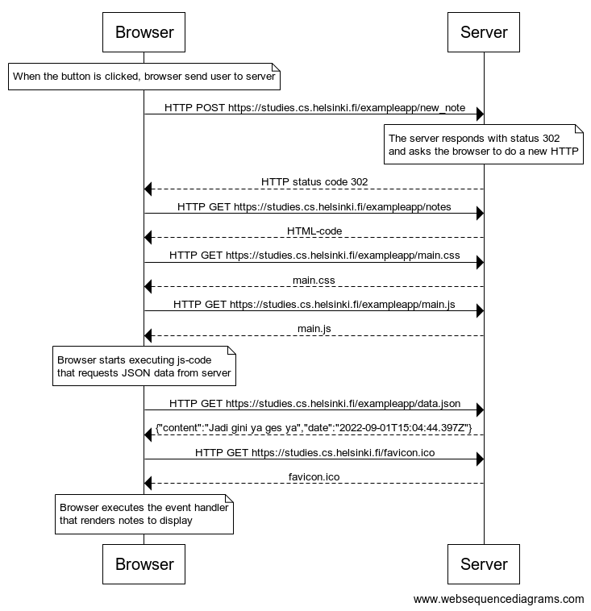
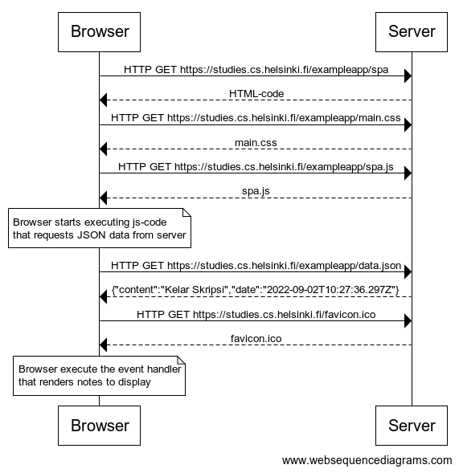
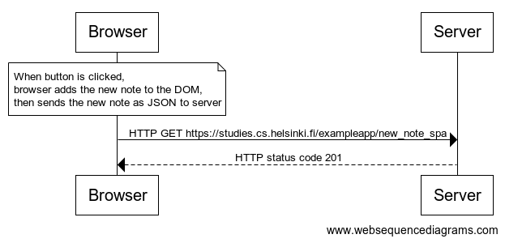

# [Part 0 - Fundamentals of Web apps](https://fullstackopen.com/en/part0)

## [0.1: HTML](#)
Review the basics of HTML by reading this tutorial from Mozilla: [HTML tutorial](https://developer.mozilla.org/en-US/docs/Learn/Getting_started_with_the_web/HTML_basics).

## [0.2: CSS](#)
Review the basics of CSS by reading this tutorial from Mozilla: [CSS tutorial](https://developer.mozilla.org/en-US/docs/Learn/Getting_started_with_the_web/CSS_basics).

## [0.3: HTML Forms](#)
Learn about the basics of HTML forms by reading Mozilla's tutorial [Your first form](https://developer.mozilla.org/en-US/docs/Learn/HTML/Forms/Your_first_HTML_form).

## [0.4: New Note](#)
In chapter Loading a page containing JavaScript - review the chain of events caused by opening the page https://studies.cs.helsinki.fi/exampleapp/notes is depicted as a sequence diagram

The diagram was made using websequencediagrams service

### Solution:

## [0.5: Single page app](#)
Create a diagram depicting the situation where the user goes to the single page app version of the notes app at https://studies.cs.helsinki.fi/exampleapp/spa.

### Solution:

## [0.6: New note](#)
Create a diagram depicting the situation where the user creates a new note using the single page version of the app.

### Solution:
